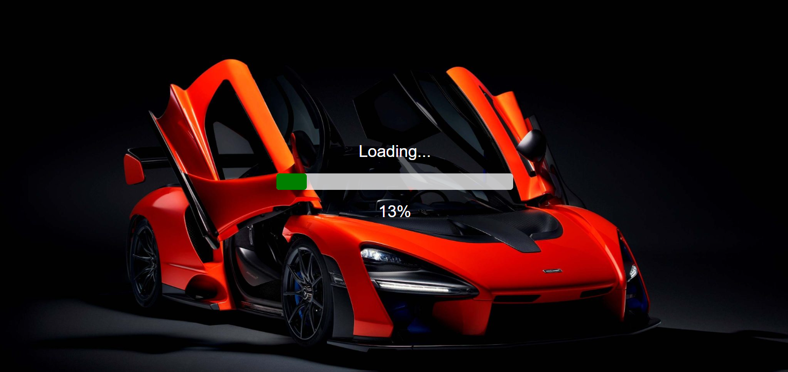
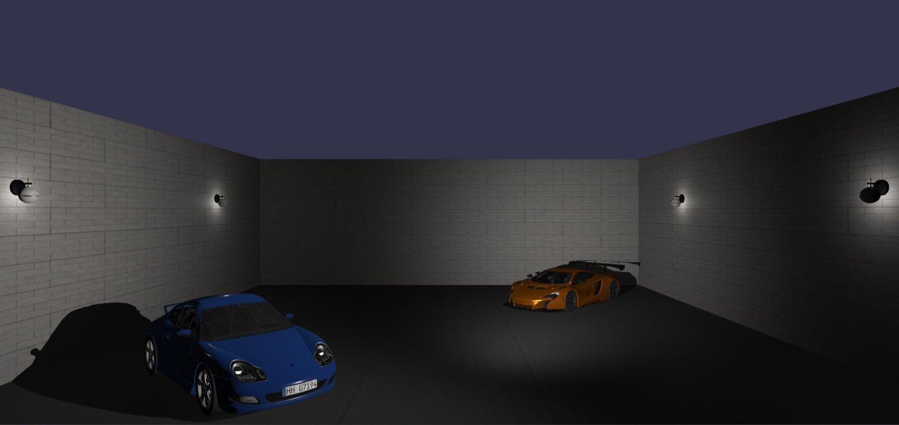
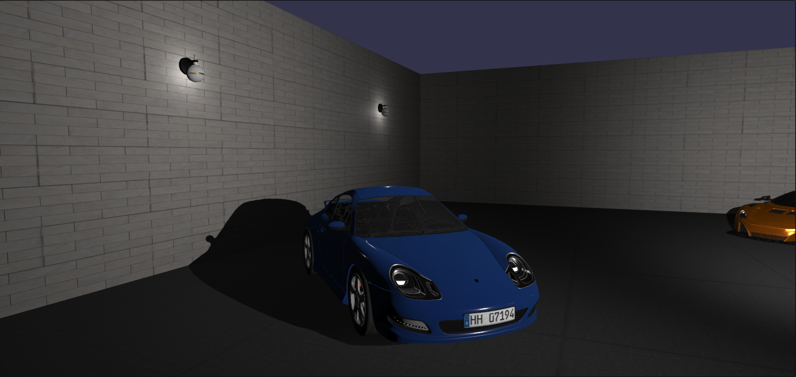
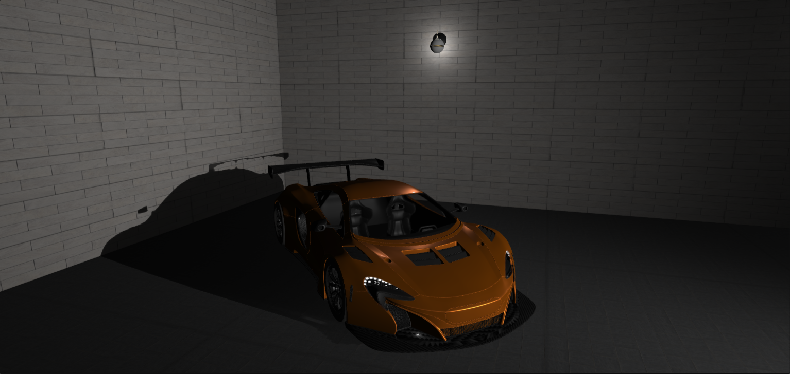
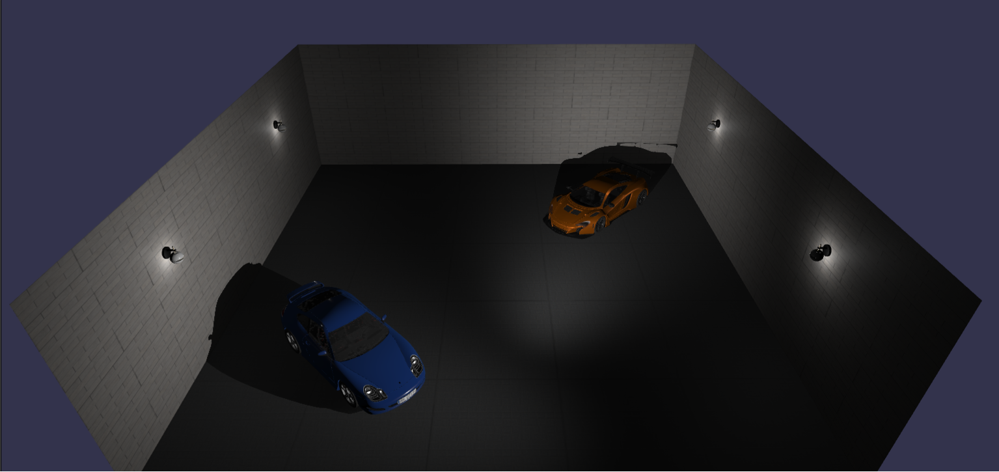

# Car Showroom

An interactive **3D Car Showroom** built with **Babylon.js** and **Vue 3**, showcasing realistic models, lighting, and a custom loading screen.  
This project was developed as part of a hands-on learning practice with Babylon.js focused on **model importing**, **lighting**, and **asynchronous loading**.

🌐 **Live Demo:** [babyloncarshowroom.netlify.app](https://babyloncarshowroom.netlify.app/)  
💻 **GitHub Repository:** [github.com/tuna-d/car-showroom](https://github.com/tuna-d/car-showroom)

## 🎯 Project Overview

This project demonstrates:

- Importing and rendering multiple 3D models (`.glb`) in Babylon.js
- Implementing **dynamic lights**, **reflections**, and **shadows**
- Creating a **custom loading screen** with progress tracking
- Integrating Babylon.js with **Vue 3 + TypeScript** for a modular setup

## 🛠️ Tech Stack

| Category           | Tools / Libraries                                                                  |
| ------------------ | ---------------------------------------------------------------------------------- |
| Frontend Framework | [Vue 3](https://vuejs.org/)                                                        |
| 3D Engine          | [Babylon.js](https://www.babylonjs.com/) (`@babylonjs/core`, `@babylonjs/loaders`) |
| Language           | TypeScript                                                                         |
| Build Tool         | Vue CLI 5                                                                          |
| Hosting            | [Netlify](https://www.netlify.com/)                                                |

## ✨ Features

- 🏎️ **3D Models:** McLaren, Porsche 911, and wall lamp
- 💡 **Dynamic Lighting:** Spotlights, realistic reflections, and shadow casting
- ⏳ **Custom Loading Screen:** Smooth progress bar during asset loading
- 🎮 **Free Camera Controls:** Explore the scene from any angle
- 🧩 **Material & Texture Handling:** PBR textures for granite and stone surfaces
- 🧱 **Scene Structure:** Clean TypeScript classes for modular Babylon.js logic

## 📁 Folder Structure

```

CAR-SHOWROOM/
├── public/
│   ├── models/
│   ├── textures/
│   │   ├── granite/
│   │   └── stone-wall/
│   ├── favicon.ico
│   └── index.html
│
├── src/
│   ├── assets/
│   │   └── logo.png
│   ├── components/
│   │   └── CarShowroom.vue
│   ├── scene/
│   │   ├── CreateShowroom.ts
│   │   └── CustomLoadingScreen.ts
│   ├── App.vue
│   ├── main.ts
│   └── shims-vue.d.ts
│
├── package.json
└── README.md

```

## ⚙️ Setup & Usage

### 🔧 Installation

```bash
# Clone the repository
git clone https://github.com/tuna-d/car-showroom.git
cd car-showroom

# Install dependencies
npm install

# Run development server
npm run serve

# Build for production
npm run build
```

Once it’s running, open your browser at **[http://localhost:8080](http://localhost:8080)**

## 📸 Preview







## 🧠 Learning Focus

This project was created as a **practice environment** for:

- Asynchronous model loading
- Scene organization with TypeScript
- PBR materials and textures
- Vue + Babylon.js integration
- Custom UI for loading and performance tracking

## 👨‍💻 Author

**Tunahan Demirel**

💻 Front-End Developer | Exploring Babylon.js and Vue

## 📜 License

This project is for **educational and portfolio purposes**.
All 3D assets belong to their respective creators.
